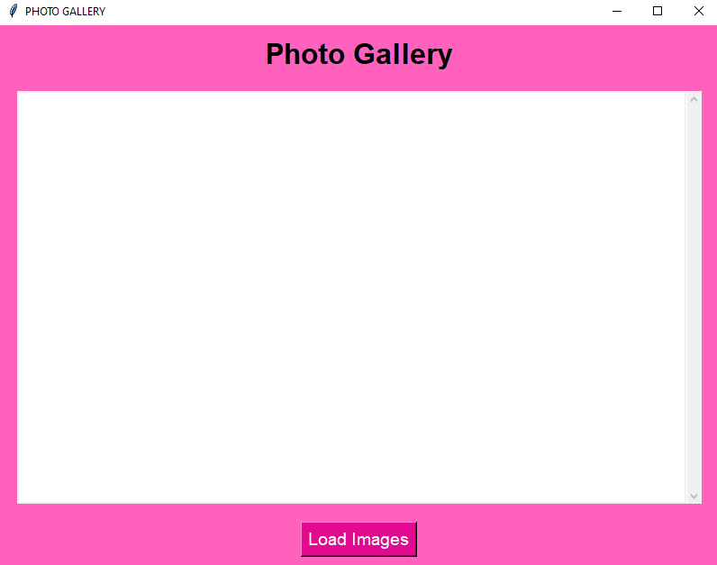
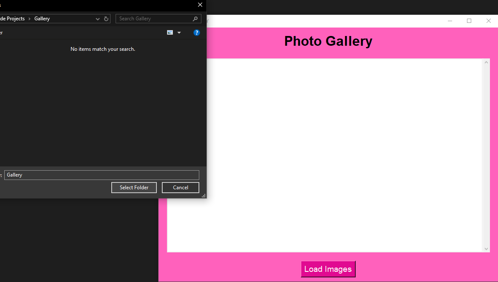
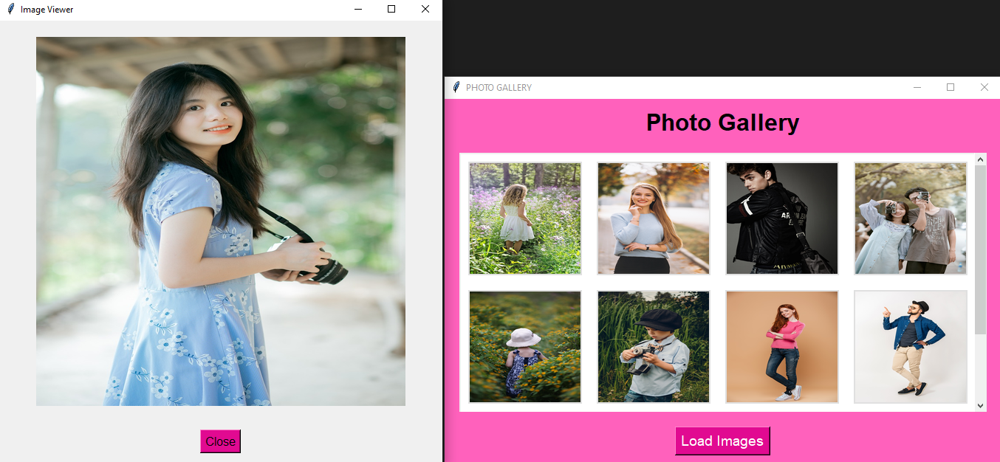

# Photo Gallery App

A simple and interactive photo gallery built with Python using **Tkinter** for the GUI and **Pillow** for image processing. This app allows users to load and view images from any selected folder in a responsive, scrollable grid layout.

<p align="center">
  
</p>

<p align="center">
  
</p>

<p align="center">
  
</p>

## Features

- **Load Images:** Browse and load images from any folder.
- **Grid Layout:** Display images in a clean, scrollable grid.
- **Image Preview:** Click on any image to view it in a larger window.
- **Responsive UI:** The app adjusts dynamically to different screen sizes.

## Requirements

Make sure you have the following installed to run the project:

- Python 3.x
- Tkinter (pre-installed with Python)
- Pillow (Install via `pip install pillow`)

## Installation

1. **Clone the Repository**:
    ```bash
    git clone https://github.com/imranfaiz786/Photo-Gallery-py.git
    cd Photo-Gallery-py
    ```

2. **Install Required Libraries**:
    ```bash
    pip install Pillow
    ```    

3. **Run the Application**:
    ```bash
    python main.py
    ```

## How to Use

- Launch the app.
- Click Load Images to select a folder with supported image formats (.jpg, .jpeg, .png, .gif, .bmp).
- Images from the selected folder will appear in a grid.
- Click any image to view it in a larger preview window.

## Customization

- Modify image size by adjusting the image_width and image_height variables.
- Change the grid layout by setting the number of columns (cols).
- Update colors in the app's design, such as background and button colors.

## Known Issues

- Only supports image files in the selected folder (no subdirectories).
- Performance may be affected with very large images.

## License

This project is licensed under the **MIT License**.